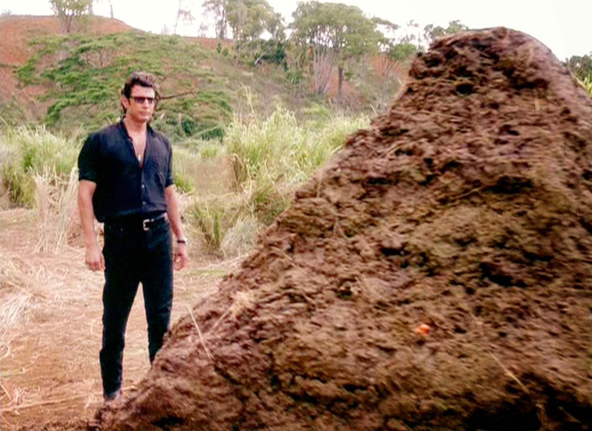

<section data-background="title.png"></section>

---

Нам дали в руки проєкт і сказали…

---

---

- Легасі
- Останній коміт 3 роки тому
- PoC

---

Приходить менеджер і каже:

---

— Там невеличка задача, треба просто зробить deep linking

---

Команда така

---

— Ми подивились в код

---

Я такий:

---

— Зара розберусь

---

Я через дві секунди:

---

— O, kurwa…

---

Кличу тімліда:

---

<table>
  <tr>
  <td>
  

  — O, kurwa…
    
  </td>
  <td>
  

  — O, kurwa…
    
  </td>
  </tr>
</table>

---

# шо робить?

---

A) Ctrl + A, Delete

B) Вивчити документацію і тести  

C) Кинуть роботу, переїхать в село, посадить огірки

D) Ваш варіянт

---

ми проходим цю гру на складності "документації нема, тести для галочки"

---

# рефакторинг!

---

Хто любить рефакторинг?

---

Хто любить рефакторинг чужого коду?

---

От і я не люблю

---

Але треба

---

Тому:

---

- Засунув гордість в дупу
- Аналізував не якість чужого коду, а визначав задачі, які він виконує
- Визначав проблеми, які заважають виконанню нових поставлених задах
- Шукав рішення цих проблем

---

це я шукаю рішення цих проблем

---

# що я зрозумів для себе

---

- Рефакторинг — не покарання
- Рефакторинг — не "переписати все наново"
- Рефакторинг — не тому, що "мені не нравиця"

---

- Рефакторинг закладає підвалини до подальшої розробки
- Рефакторинг повинен бути акуратним та покроковим
- Рефакторинг може бути цікавим та пізнавальним

---

# висновок

- Не спішіть
- Досліджуйте, а не ганьбіть
- Переписуючи, вчіться

<small>і будьте простіше, ваш прекрасний новий код стане ужасним легасі приблизно через тиждень</small>

---

# дякую

---

Донатьте на ЗСУ

<small>на fpv-дрони для 38 ОМБр</small>

---

Донатьте на ЗСУ

<small>на авто для взводу БПЛА з підрозділу батареї управління артилерійської розвідки 65-ї ОМБр на запорізький напрямок.</small>